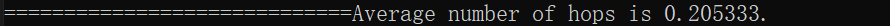

# COP5615 : Project 3
The goal of this project is to implement in F# using the actor model the pastry protocol and a simple object access service to prove its usefulness.

CONTENTS OF THIS FILE 
---------------------
   
 * Team Members  
 * Introduction
 * Pre-requisites
 * Program inputs
 * Running project3.tgz
 * Running project3-bonus.tgz

TEAM MEMBERS
----------------

  Yu, Mingjun (UFID 6170-7843)
  
  Sun, Hui (UFID 6654-2614)

* What is working

  - We successfully implemented Pastry APIs for network join and routing as required in project description.
  - NumOfNodes of nodes are getting added to the network, and begin requesting/second in 1 second.
  - We have successfully implement the joining of nodes and the sending of messages.
  - The final output: average number of hops.
  - We have a function called randomizer(x: int) which could help us change the range of the random nodeId. i.e. if we specify randomizer(8) which means our nodeId would range from 0 to 65535. if we specify randomizer(12) which means our nodeId would range from 0 to 16777215.
  - We could also change parameter b which mentioned in pastry paper. This could also change the range of the random nodeId.

* What is the largest network you managed to deal with

We managed to create a Pastry network of about 50000 nodes. But in this case, we would spend a lot of time to create nodeid, because there are many duplicate nodeid with the incresing of the network, our code needs time to delete those duplicate nodes.

INTRODUCTION
------------
The project folder contains 1 folders:

* project3: Contains the files related to the Pastry network project.
          - Boss.fs
          -createNodeid.fs
          -Implementation.fs
          -Program.fs
          -Worker.fs
         

PRE-REQUISITES
------------
The following need to be installed to run the project:
* Visual Studio
* F#

PROGRAM INPUTS
------------
* PASTRY
  - numNodes
  - numRequests

RUNNING project3
------------------------------
Use Visual Studio to open project3 and then click run button. Input two integers in the pop-up window, the first integer is numNodes and the last is numRequests. Our project needs some dependencies like Akka, FSharpx.Collections. There may be some situations that the code could stop at some specific stoppingThreshold. It would be better if you could run it again. If the numofnodes > 2000, it would spend a lot of time to run our code, because we need a lot of time to generate nodeid.

ANSWER
------------------------------
 
Above is the answer when we run with input 1000, 3. 
 
Above is the answer when we run with input 10000, 3. 